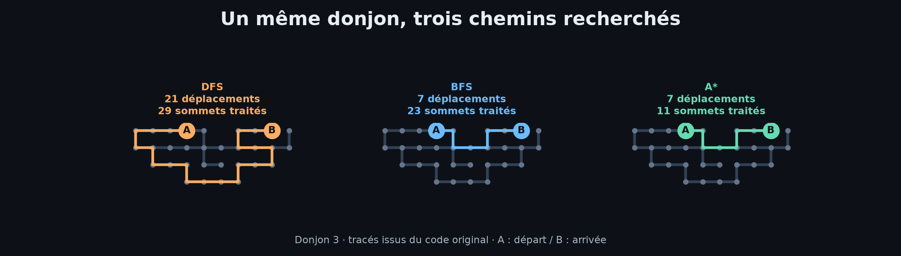
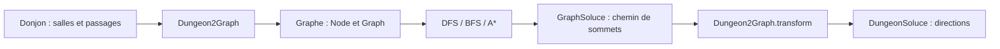

# 🧭 Exploration de donjons


**Trouver une sortie, puis comparer les chemins pour y arriver.**

J'ai réalisé ce projet avec **Célian Gloro** pour comparer trois algorithmes de recherche de chemins : **DFS**, **BFS** et **A\***. Le programme transforme un donjon en graphe, recherche un itinéraire entre deux salles et traduit la solution en directions à suivre.

Huit donjons permettent d'observer l'effet de la disposition des salles et des passages sur le chemin obtenu et le nombre de sommets traités.

## 👀 Aperçu des parcours



*Visualisation ajoutée pour la présentation du dépôt, à partir de parcours réellement produits par le code original. L'application s'exécute en console ; cette image n'est pas une capture d'interface.*

## ✨ Fonctionnalités

- Représentation des salles, de leurs coordonnées et des passages entre elles.
- Conversion d'un donjon en graphe non orienté.
- Recherche d'un chemin avec DFS, BFS et A*, puis reconstruction de l'itinéraire.
- Conversion du chemin en déplacements `NORTH`, `SOUTH`, `EAST` et `WEST`.
- Chargement de donjons décrits dans des fichiers texte et comparaison sur huit scénarios.
- Affichage de la solution, du nombre de sommets traités et du temps cumulé des résolutions.

## 🛠️ Technologies & outils

| Élément | Utilisation |
|---|---|
| **Java** | Modèle objet, graphes et algorithmes de recherche |
| **Collections Java** | `HashMap`, `HashSet`, `ArrayList`, file `LinkedList` et `PriorityQueue` |
| **Fichiers texte** | Description des donjons 3 à 8 |
| **Java Logging** | Affichage des résultats en console |
| **JDK** | Compilation et exécution sans bibliothèque externe |

## 🧠 Trois stratégies de recherche

| Algorithme | Stratégie dans le projet | Ce que l'on compare |
|---|---|---|
| **DFS** | Exploration récursive en profondeur | Trouve un chemin, qui peut comporter des détours |
| **BFS** | Exploration par niveaux avec une file | Recherche un chemin minimal en nombre de déplacements sur ce graphe à coûts unitaires |
| **A\*** | File de priorité, coût parcouru + distance de Manhattan | Oriente l'exploration vers l'arrivée en tenant compte du chemin déjà parcouru |

L'heuristique de Manhattan utilise les coordonnées des salles : `abs(xA - xB) + abs(yA - yB)`. Les déplacements sont horizontaux ou verticaux. Les obstacles peuvent imposer des détours et réduire l'avantage de cette estimation.



## 📊 Résultats & interprétation

Exemples obtenus lors de la vérification du dépôt avec **OpenJDK 21**, à partir du code original :

| Donjon | DFS : déplacements / sommets traités | BFS : déplacements / sommets traités | A* : déplacements / sommets traités |
|---|---:|---:|---:|
| 3 | 21 / 29 | 7 / 23 | 7 / 11 |
| 6 | 86 / 326 | 10 / 81 | 10 / 21 |
| 7 | 199 / 369 | 57 / 528 | 57 / 291 |
| 8 | 74 / 96 | 32 / 108 | 32 / 108 |

[Consulter les 24 résultats au format CSV](docs/resultats.csv).

Sur ces huit donjons, les chemins de BFS et A* ont été vérifiés contre un calcul indépendant de distance minimale. Les 24 itinéraires rejoignent l'arrivée et leur conversion en directions a également été contrôlée.

Le donjon 6 illustre l'intérêt d'A* pour limiter l'exploration. Le donjon 8 montre que cet avantage dépend de la configuration : BFS et A* y traitent autant de sommets. DFS peut trouver un chemin beaucoup plus long que nécessaire.

**Bien lire les mesures :**

- `Steps` compte les sommets traités pendant la dernière résolution ; ce n'est pas le nombre de déplacements du chemin final.
- `Temps (ms)` est le **temps total de 10 000 résolutions** pour un algorithme sur un donjon, comme défini par `NB_ATTEMPTS` dans `Scenarios.java`.
- L'ordre d'itération des collections n'est pas fixé : les parcours, certains nombres de sommets traités et les résultats du rapport peuvent différer d'une exécution à l'autre.
- Les temps dépendent de la machine et de la JVM. Ils constituent une comparaison expérimentale, pas un benchmark normalisé ni une mesure de consommation mémoire.

## 👤 Ma contribution

Dans le binôme, je me suis principalement chargé de la **modélisation et de la liaison entre les différentes étapes de résolution** :

- Développement des classes **`Graph` et `Node`** et de la conversion donjon → graphe dans **`Dungeon2Graph`**.
- Mise en place de l'interface **`Solver`** et de la structure commune **`SolverGeneric`**.
- Reconstruction et conversion de la solution, avec **`GraphSoluce`** et **`Dungeon2Graph`**.
- Conception du **donjon 7** pour enrichir les cas de comparaison.
- Développement d'**A\*** et analyse des résultats **avec Célian**.

Célian a principalement développé **DFS et BFS** et conçu le **donjon 8**. Cette répartition reprend celle de notre rapport de projet.

## 🚀 Lancer le projet

Prérequis : un **JDK 21**, avec `java` et `javac` disponibles dans le terminal. C'est la version utilisée pour vérifier les commandes ci-dessous.

Télécharger le dépôt avec **Code → Download ZIP** et le décompresser, ou le cloner :

```sh
git clone https://github.com/D-Berat/exploration-donjons.git
cd exploration-donjons
```

Depuis la racine du projet, compiler puis lancer :

```sh
javac -encoding UTF-8 -d out @sources.txt
java -cp out sae.Scenarios
```

Sous **PowerShell**, entourer `@sources.txt` de guillemets :

```powershell
javac -encoding UTF-8 -d out "@sources.txt"
java -cp out sae.Scenarios
```

Lancer le programme depuis la racine est nécessaire pour qu'il retrouve `Donjon3.txt` à `Donjon8.txt`. Les huit scénarios se succèdent automatiquement. Le traitement peut prendre plusieurs dizaines de secondes ou davantage, car chaque résolution est répétée 10 000 fois.

Les commandes et `sources.txt` ont été ajoutés pour faciliter l'utilisation du dépôt ; ils ne figuraient pas dans le rendu initial.

## 📁 Organisation

```text
src/sae/
├── Scenarios.java     # Point d'entrée et mesures
├── dungeon/           # Salles, coordonnées, directions et lecture des donjons
├── graph/             # Graphe, sommets et solution
├── solver/            # Interface commune, DFS, BFS et A*
├── transform/         # Conversions donjon / graphe / directions
└── util/              # Lecture des fichiers
Donjon3.txt … Donjon8.txt
docs/                  # Rapport, sujet, visualisation et résultats
sources.txt            # Liste des sources à compiler
```

## 📄 Documents & contexte

Projet réalisé en binôme en **BUT Informatique**, à partir d'un socle Java fourni pour la représentation des donjons et les scénarios. Les classes de graphe, les solveurs et la conversion ont été développés dans notre rendu ; le projet ne part donc pas entièrement de zéro.

**Résultat : 18,5/20**, meilleure note du relevé d'évaluation fourni, obtenue par les deux membres du binôme.

- [Rapport original : démarche, répartition du travail et analyse](docs/rapport.pdf)

Le rapport est conservé tel que rendu. Pour interpréter ses chiffres de temps et de « Steps », se référer aux précisions de la section **Résultats & interprétation** ci-dessus.

<details>
<summary>Consulter le sujet d'origine</summary>

[Sujet détaillé du projet (PDF)](docs/sujet.pdf)

</details>

<details>
<summary>Préparation du dépôt et fidélité au rendu</summary>

Les **18 fichiers Java** et les **6 fichiers de donjons** sont conservés à l'identique, sans modification du code ni renommage des classes ou packages.

Les ajouts de présentation sont ce README, `.gitignore`, `.gitattributes`, `sources.txt`, la visualisation et le CSV de vérification. Le rapport et le sujet ont été copiés sous des noms plus courts dans `docs/`.

Les fichiers compilés (`bin/`), les réglages locaux d'Eclipse et les fichiers système (`.DS_Store`) ne sont pas publiés. Le relevé de notes des étudiants reste hors du dépôt. Le nom historique du package `sae` est conservé pour préserver le code original.

</details>
